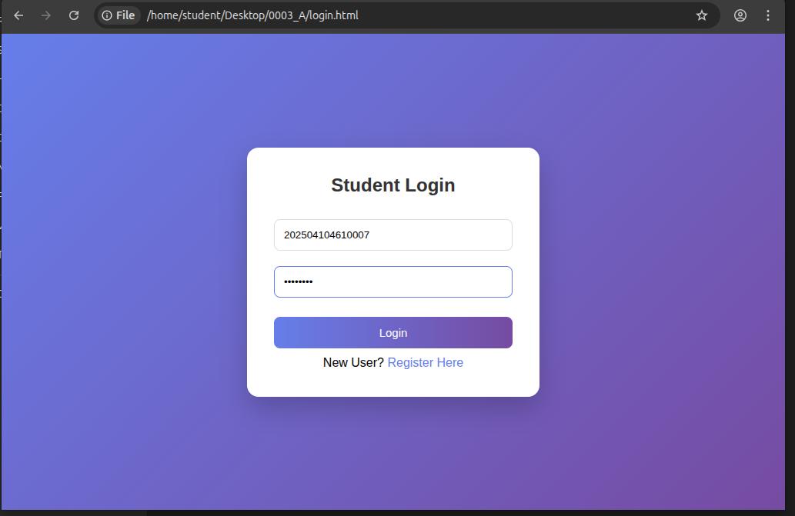
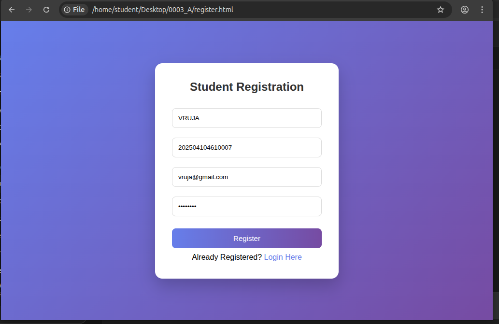
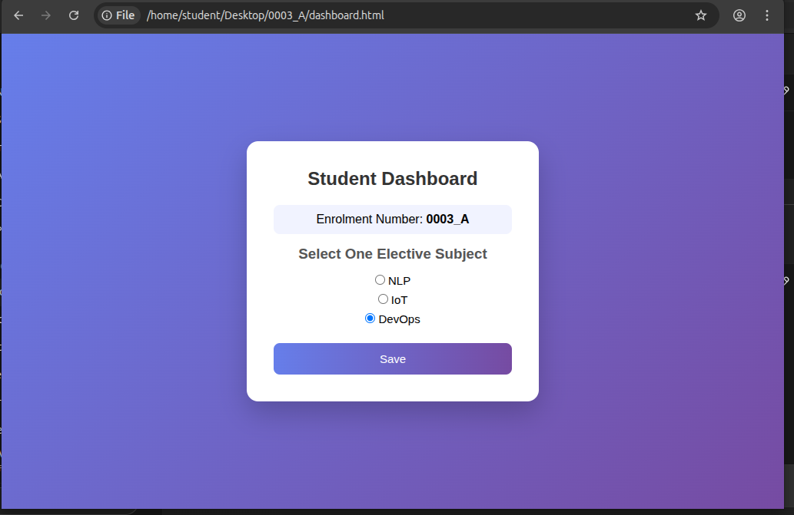

# 🎓 Student Application UI Project

## 📌 Project Name:
0003_A

---

## 📖 Project Description

This project is a Student Application User Interface developed using HTML, CSS, and optional JavaScript.

The project is strictly limited to UI design only.  
No backend or database functionality is implemented.

The application includes:
- Student Login Page
- Student Registration Page
- Student Dashboard Page
- Elective Subject Selection (Only One Allowed)

---

## 🛠️ Technologies Used

- HTML5
- CSS3

---

## 📸 Screenshots

### Login Page

### Registration Page

### Dashboard Page

---

## 🚀 How to Run the Project

1. Download or clone the repository.
2. Open the project folder.
3. Double-click on `login.html`.
4. The project will open in your web browser.

No server or backend setup is required.

---

## 🌐 GitHub Repository URL

# 🎓 Student Application UI Project

## 📌 Project Name:
0003_A

---

## 📖 Project Description

This project is a Student Application User Interface developed using HTML, CSS, and optional JavaScript.

The project is strictly limited to UI design only.  
No backend or database functionality is implemented.

The application includes:
- Student Login Page
- Student Registration Page
- Student Dashboard Page
- Elective Subject Selection (Only One Allowed)

---

## 🛠️ Technologies Used

- HTML5
- CSS3
- JavaScript

---

## 📁 Project Structure

0003_A/
│── login.html  
│── register.html  
│── dashboard.html  
│── style.css  
│── README.md  
│── screenshots/  
│     ├── login.png  
│     ├── register.png  
│     └── dashboard.png  

---

## 📸 Screenshots

### Login Page

### Registration Page

### Dashboard Page

---

## 🚀 How to Run the Project

1. Download or clone the repository.
2. Open the project folder.
3. Double-click on `login.html`.
4. The project will open in your web browser.

No server or backend setup is required.

---

## 🌐 GitHub Repository URL

https://github.com/vishwasurati09/0003_A.git

---

## 👨‍🎓 Author

Name: (Your Name)  
Enrolment Number: 0003_A  

---

Example:
https://github.com/yourusername/0003_A

---

## 👨‍🎓 Author

Name: Vishwa surati 
Enrolment Number: 0003_A  

---
